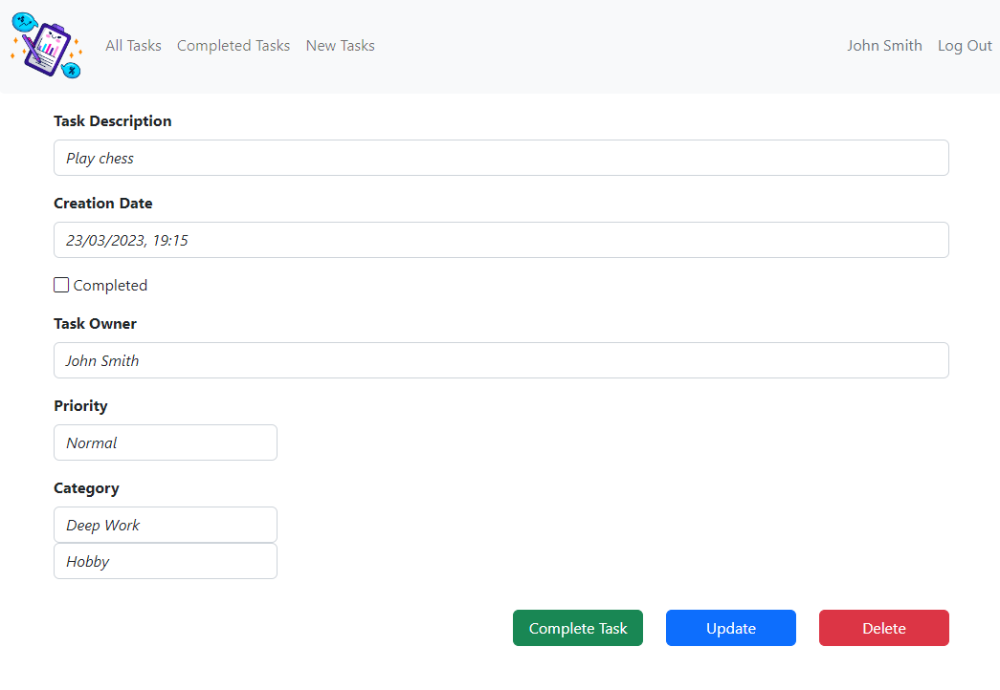
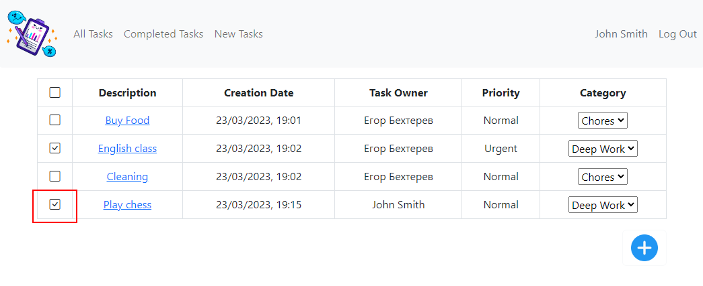

# job4j_todo

## Описание проекта

* Web-приложение, представляющее собой "TODO список".
* Основная страница содержит все созданные задачи.
* Пользователь может добавлять, редактировать и удалять задания. Ставить отметку об их завершении.
* Реализована авторизация и аутентификация пользователей сервиса.

## Стек технологий

- **Java 17.0.2**
- **Spring Boot 2.7.6**
- **Hibernate 5.6.11**
- **Lombok 1.18.22**
- **Thymeleaf**
- **Bootstrap 5.2.3**
- **HTML5**
- **PostgreSQL 15**
- **Liquibase 4.15.0**
- **Maven 3.8.1**

## Требования к окружению

- **Java 17.0.2**
- **Maven 3.8.1**
- **PostgresSQL 15**

## Сборка и запуск

- **Создать БД**

``` 
create database todo;
```

- **Запустить проект по команде**

``` 
mvn spring-boot:run -Pproduction
```

- **Перейти в браузере по ссылке**

``` 
http://localhost:8080/
```

## Взаимодействие с приложением

### Главная страница. Отображает список всех заданий. В таблице отображены название задачи, дата создания и текущее состояние. Имеется возможность добавить задание.


### Страница с незавершенными задачами. Реализована аналогичная страница для выполненных задач.


### При клике на задание осуществляется переход на страницу с подробным описанием.


### При нажатии на Complete Task состояние задачи изменяется на завершенное.


### При нажатии на Update появляется возможность отредактировать описание задачи, изменить ее состояние, приоритет, категории.


### Форма с регистрацией пользователя.


### Если пользователь создает аккаунт с уже зарегистрированным ранее login'ом, отображается страница с ошибкой.


### Для работы с задачами пользователю нужно авторизоваться. Ниже форма авторизации пользователя.


### При вводе некорректных данных отображается форма с ошибкой.


### На странице пользователя реализован выбор часового пояса. Отображение задач осуществляется с учетом установленной временной зоны.


### Основная страница после изменения часового пояса.


## Контакты для связи
telegram: <a href="https://t.me/bekhterev_egor" target="blank">@bekhterev_egor</a>
